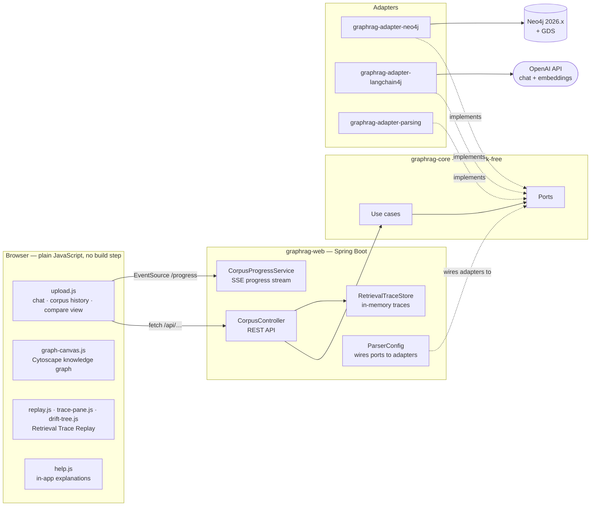
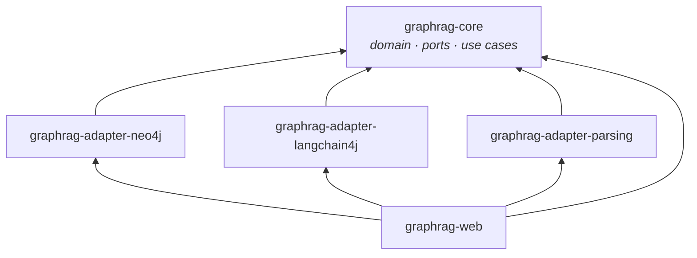
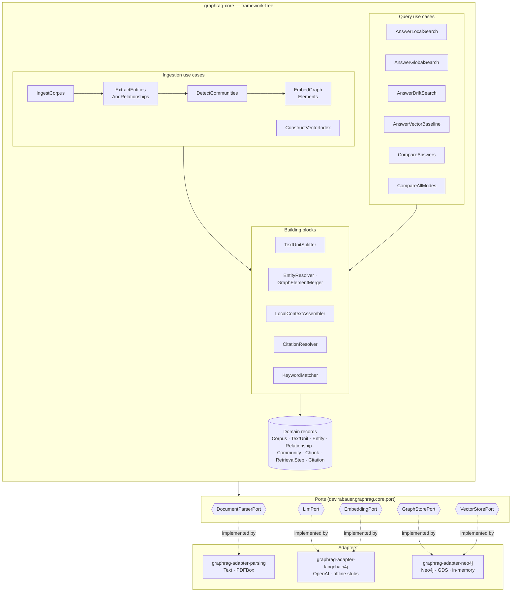
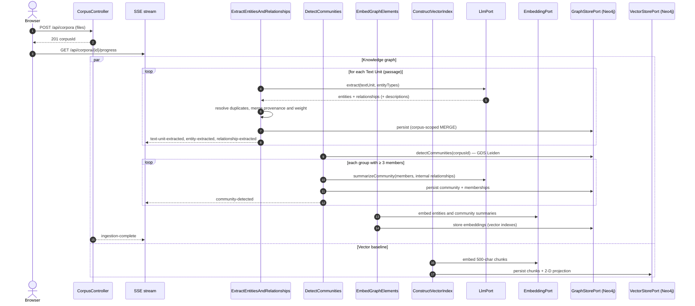
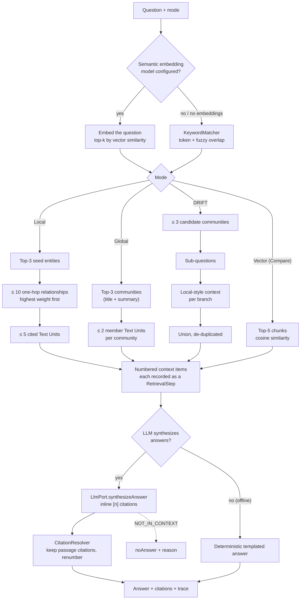
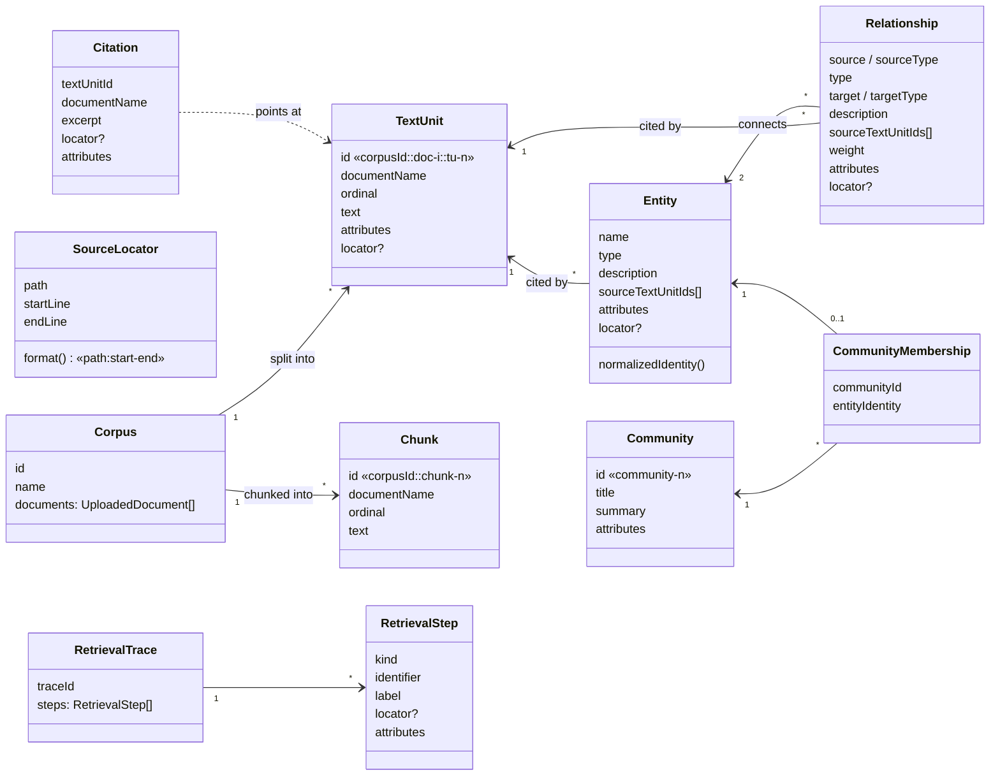
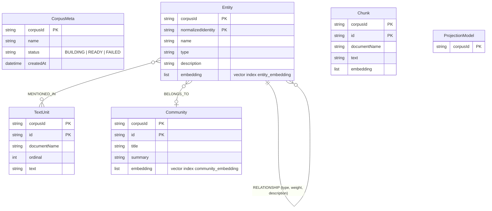

# GraphRAG Lens

GraphRAG Lens is a teaching and demo tool that shows **how GraphRAG works** rather than only what it answers.

**Website:** <https://johannesrabauer.github.io/graph-rag-visualisation/> — an illustrated walk through the whole application, built from the `docs/` folder and published by the [Website workflow](.github/workflows/pages.yml) on every push to `main`.

**Video:** <https://youtube.com/live/fWOptSc7wpk>

[](https://youtube.com/live/fWOptSc7wpk)

You upload a corpus (plain text or PDF), watch it turn into a knowledge graph passage by passage, see communities form, and ask questions in three GraphRAG modes: **Local**, **Global** and **DRIFT**. Each answer is LLM-written and cites the exact source passages it used. A step-by-step **Retrieval Trace Replay** shows on the graph which entities, relationships, communities and passages each answer touched. A **Compare** view sets every GraphRAG answer against a plain vector-RAG baseline and explains where each approach does better, and why. A **four-way comparison** runs Local, Global, DRIFT and Vector Search on the same question and lines up their answers, traversal steps, latency (retrieval, embedding and LLM time) and evidence, so a wrong answer can be traced to retrieval, ranking or generation.

The heart of the project is [`graphrag-core`](graphrag-core/README.md), a framework-free GraphRAG library behind a hexagonal (ports and adapters) boundary. The web app and the adapters are one way of plugging it in.

---

## Contents

- [Quick start](#quick-start)
- [System architecture](#system-architecture)
- [The core: `graphrag-core`](#the-core-graphrag-core)
  - [Hexagonal shape](#hexagonal-shape)
  - [Ports](#ports)
  - [Use cases](#use-cases)
  - [Ingestion pipeline](#ingestion-pipeline)
  - [Answering a question](#answering-a-question)
  - [Grounding and citations](#grounding-and-citations)
  - [Domain model](#domain-model)
- [Persistence model (Neo4j)](#persistence-model-neo4j)
- [Live vs offline behaviour](#live-vs-offline-behaviour)
- [Web application](#web-application)
- [Build and test](#build-and-test)
- [Running the app](#running-the-app)
- [Definition of done](#definition-of-done)

---

## Quick start

```bash
OPENAI_API_KEY=sk-... docker compose up
```

Open <http://localhost:8080>. You can upload a `.txt` or `.pdf` corpus, load the built-in demo dataset, or use the **Offline Demo**, which makes no API calls. Without an `OPENAI_API_KEY`, the app runs fully offline with deterministic stand-ins for the LLM and the embeddings (see [Live vs offline behaviour](#live-vs-offline-behaviour)).

---

## System architecture

The system is two containers, the Spring Boot app and Neo4j (with the Graph Data Science plugin), plus the OpenAI API when a key is configured.



### Modules



| Module | Purpose |
| --- | --- |
| [`graphrag-core`](graphrag-core/README.md) | The GraphRAG library: domain model, port interfaces and use cases. It is **framework-free**: a Maven Enforcer rule bans Spring, the Neo4j driver and LangChain4j, so the core can be reused in any Java application. It is versioned and released independently (`dev.rabauer.graphrag:graphrag-core`). |
| `graphrag-adapter-neo4j` | `GraphStorePort` and `VectorStorePort` on Neo4j through the plain Java driver. It provides corpus-scoped writes, GDS Leiden community detection, vector indexes for semantic matching, and the durable corpus registry. It also has in-memory variants for tests. |
| `graphrag-adapter-langchain4j` | `LlmPort` and `EmbeddingPort` on OpenAI through LangChain4j (JSON-mode prompts, no retries). It also contains the deterministic offline stand-ins `LangChain4jLlmPort` and `LangChain4jEmbeddingPort`. |
| `graphrag-adapter-parsing` | `DocumentParserPort` for plain text and PDF (PDFBox). |
| `graphrag-web` | The Spring Boot app: REST and SSE endpoints, wiring, and the plain-JS frontend (Thymeleaf template, Cytoscape from a CDN, no Node/npm tooling). |

---

## The core: `graphrag-core`

### Hexagonal shape

All GraphRAG logic sits in the centre: splitting text into passages, extraction, entity resolution, community detection, semantic matching, context assembly, answer synthesis and citations. Everything the core needs from the outside world goes through one of five **ports**. Adapters implement the ports; the core never imports them.



Design rules that keep the core reusable:

- **Only the abstract methods are required.** Every port has a small set of abstract methods. Everything else is a `default` method with a sensible fallback, so a minimal adapter works out of the box and a richer one overrides what it can do natively. For example, `GraphStorePort.detectCommunities` defaults to connected components, and the Neo4j adapter overrides it with GDS Leiden.
- **Every read and write is scoped to a `corpusId`.** Many corpora live side by side in one store.
- **Failures are visible, never silent.** LLM and embedding errors propagate, and nothing is retried automatically. The app turns them into a FAILED corpus status or an `{"error": …}` response.
- **Capabilities are explicit.** `LlmPort.synthesizesAnswers()` and `EmbeddingPort.isSemantic()` tell the use cases whether a real model is behind the port. When there isn't one, they fall back to deterministic behaviour.

### Ports

| Port | Responsibility | Required methods | Notable optional capabilities |
| --- | --- | --- | --- |
| `DocumentParserPort` | Turn an uploaded file into text | `supports(filename)` | `extract(filename, bytes)` |
| `LlmPort` | Everything a language model does | `extract(Corpus)` | `extract(TextUnit, entityTypes)`, `summarizeCommunity(members, relationships)` → title + summary, `deriveDriftSubQuestions`, `synthesizeAnswer(question, context)` with `[n]` citations, `compareAnswers` → verdict |
| `EmbeddingPort` | Text → dense vector | `embed(text)` | `isSemantic()` |
| `GraphStorePort` | The knowledge graph | `persistEntities`, `persistRelationships` | Corpus-scoped CRUD for entities, relationships, Text Units, communities and memberships; `detectCommunities(corpusId)`; `persistEntityEmbeddings` / `similarEntities` and their community counterparts for semantic matching |
| `VectorStorePort` | The plain vector-RAG baseline | `persistChunks` | `chunks`, `persistProjectionModel` / `projectionModel` for a 2-D embedding projection (no longer shown in the UI) |

### Use cases

| Use case | What it does |
| --- | --- |
| `IngestCorpus` | Validates uploads and builds a `Corpus` from parsed documents. |
| `ExtractEntitiesAndRelationships` (`BuildKnowledgeGraph`) | Splits the corpus into overlapping **Text Units** (about 6,000 characters each, with about 600 characters of overlap). It asks the LLM for entities and relationships **one passage at a time**, resolves duplicates (`EntityResolver`), merges descriptions and provenance (`GraphElementMerger`), and persists after every passage, so the graph grows live. |
| `DetectCommunities` | Groups entities with `GraphStorePort.detectCommunities` (GDS Leiden on Neo4j; the core's pure-Java modularity detector by default) and keeps groups of **at least 3** members (`MIN_COMMUNITY_SIZE`). It asks the LLM for a title and summary written from the members' descriptions and internal relationships. Options add bounded parallelism, a per-run budget, per-item failure isolation and summary reuse. |
| `ImportKnowledgeGraph` | Imports an exact, pre-built graph (for example from a code scan) without any extraction call, then detects Communities (or takes the caller's) and embeds. |
| `EmbedGraphElements` | When the embedding model is semantic, embeds every entity (`name: description`) and community summary for meaning-based seed matching. |
| `ConstructVectorIndex` | Builds the vector baseline: 500-character chunks, their embeddings, and a fitted 2-D projection. |
| `AnswerLocalSearch` | Seeds on the entities closest to the question and walks their one-hop neighbourhood into the Text Units it cites. |
| `AnswerGlobalSearch` | Answers from the top community summaries and each community's most relevant passages. |
| `AnswerDriftSearch` | Starts from communities, spawns sub-questions, gathers Local-style context for each branch, and synthesizes once over the union. |
| `AnswerVectorBaseline` | Plain vector RAG: top-5 chunks by cosine similarity, synthesized and cited the same way. It also returns the similarity ranking (the top 12 scored chunks, the top 5 marked as used) and how many chunks it scored. |
| `CompareAnswers` | Runs a GraphRAG mode and the vector baseline fresh, then measures context, documents, overlap and latency, and produces a verdict. |
| `CompareAllModes` | Runs all four methods (Local, Global, DRIFT, Vector Search) one after the other on the same question. Per method: the answer, citations, traversal steps with a count per kind, and the time split into retrieval, embedding and LLM (`StageTiming`, measured by wrapping the ports). Across methods: an evidence table saying how far each passage got in each method (not retrieved, ranked below the vector cut-off, in context, cited). A failing method is reported, not thrown. |

### Ingestion pipeline

Ingestion runs asynchronously after an upload. Every step reports progress on the SSE stream, so the browser draws the graph while it is being built.



A failure in any step marks the corpus **FAILED** and sends an `error` event that names the step: extraction, community detection, embedding, or the LLM.

### Answering a question

All three GraphRAG modes, and the vector baseline, follow the same pattern: **find starting points → assemble a bounded context → record every item as a trace step → let the LLM write a cited answer**.



The **Retrieval Trace** is the ordered list of `RetrievalStep`s (`ENTITY`, `RELATIONSHIP`, `COMMUNITY`, `TEXT_UNIT`, `SUB_QUESTION_SPAWNED`, `SYNTHESIS`, `VECTOR_QUERY_EMBEDDED`, `VECTOR_CHUNK`). The browser replays it on the graph canvas, in the DRIFT tree, or, for the vector baseline, in the Compare view's similarity ranking.

### Grounding and citations

What makes an answer verifiable is that its citations are guaranteed to point at passages the search actually read:

1. The use case numbers every context item `[1]..[n]` in the order it assembled them.
2. The prompt lets the model cite **only "Source passage" items**. Entities, relationships and community summaries are background facts.
3. `CitationResolver` drops any marker that is not a passage of the given context, renumbers the kept ones `1..k` by first appearance, and returns `citations[{textUnitId, documentName, excerpt}]`. So `[i]` in the text always means `citations[i-1]`.
4. Every cited passage is a `TEXT_UNIT` step of the same trace, which Replay highlights together with the entities that cite it.
5. If the model answers that the context does not contain the answer, the result becomes `noAnswer`. It never becomes an invented answer.

### Domain model



`attributes` (a key-sorted `Map<String, String>`, never null) and `locator` (a
`SourceLocator`, null when unknown) are optional on every element; the text
pipeline leaves them empty, an imported code graph fills them (see
[`graphrag-core/README.md`](graphrag-core/README.md#code-and-other-structured-sources)).
Entity and Relationship types are free-form strings.

---

## Persistence model (Neo4j)

Every node and relationship carries a `corpusId`, and every `MERGE` is keyed by it.



- **Community detection:** projects only the corpus's entities and relationships as an undirected GDS graph weighted by `weight`, runs `gds.leiden.stream` with a fixed seed, and always drops the projection again.
- **Semantic matching:** one vector index per label (`entity_embedding`, `community_embedding`) spans all corpora and is filtered by `corpusId` with Cypher's `SEARCH … WHERE` clause.
- **Corpus registry:** corpora survive restarts. Corpora interrupted mid-build are reconciled to FAILED on startup.

---

## Live vs offline behaviour

| | With `OPENAI_API_KEY` | Offline (no key, or the Offline Demo) |
| --- | --- | --- |
| Extraction | LLM per passage, with descriptions | Regex/sentence-based stub |
| Communities | GDS Leiden + LLM title and summary | GDS Leiden (or connected components in memory) + templated summary |
| Seed matching | Embedding similarity (top-3) | `KeywordMatcher` |
| Answers | LLM-written with `[n]` citations | Deterministic templates, no citations |
| Vector baseline | LLM-written with chunk citations | Joined chunk texts |
| Compare verdict | LLM verdict (≤ 2 sentences) | Rule-based summary of the key figures |

Offline mode is fully deterministic, which is why CI and every test run with the key **unset**.

---

## Web application

The frontend is plain JavaScript modules on one page:

- **`upload.js`**: corpus upload and history, the chat with citation markers and a Sources list, and the Compare view with the vector side's similarity ranking (the top 12 chunks by cosine score, the 5 used for the answer marked above a cut-off line). The same tab holds the four-way comparison: one column per method (answer, time bar split into retrieval / embedding / LLM, traversal footprint, replay), the evidence table where a passage can be marked as the expected evidence to diagnose each method's miss, and a JSON log download.
- **`graph-canvas.js`**: the Cytoscape knowledge graph, community hulls, and a one-line legend with an "All communities" side-panel list.
- **`replay.js` / `trace-pane.js` / `drift-tree.js`**: step-by-step Retrieval Trace Replay on the graph, the Retrieval Trace pane that lists every step by phase with the reason it was taken, the branching DRIFT tree inside that pane, and, for the vector baseline, a replay on the Compare tab that lights up the similarity ranking hit by hit.
- **`help.js`**: contextual help topics (`static/help/*.html`), each with a live "in your data" view.

The main endpoints:

| Endpoint | Purpose |
| --- | --- |
| `POST /api/corpora` · `POST /api/corpora/demo` · `POST /api/corpora/demo-offline` | Create a corpus and start ingestion |
| `GET /api/corpora/{id}/progress` | SSE progress stream (never times out; keep-alive every 15 s) |
| `GET /api/corpora` · `POST /api/corpora/{id}/activate` | Corpus history and switching |
| `GET /api/corpora/{id}/graph` | Entities, relationships and communities for the canvas |
| `POST /api/corpora/{id}/query` | Ask a question (`LOCAL`, `GLOBAL`, `DRIFT`, `VECTOR`) |
| `POST /api/corpora/{id}/compare` | GraphRAG vs vector comparison |
| `POST /api/corpora/{id}/compare-all` | All four retrieval methods side by side: answers, steps, timing and the evidence table |
| `GET /api/traces/{traceId}` | A Retrieval Trace for Replay |
| `GET /api/corpora/{id}/text-units/{tuId}` · `…/chunks/{chunkId}` | Passage text for citations |

---

## Build and test

Requirements:

- **JDK 25**. The build enforces it and fails fast if it is not on `JAVA_HOME`/`PATH`.
- Apache Maven 3.9+.
- Docker, for the Testcontainers-based Neo4j tests, which also download the GDS plugin.

```bash
mvn package
```

This builds all five modules and produces the executable jar at `graphrag-web/target/graphrag-web.jar`.

Run the tests the way CI does, with the OpenAI key unset. With a key, the Spring and Playwright UI tests would call the real model and become non-deterministic.

```bash
env -u OPENAI_API_KEY mvn -B install
```

On Docker 29 you may need `-Dapi.version=1.44` so Testcontainers can find the Docker daemon.

---

## Running the app

```bash
OPENAI_API_KEY=sk-... docker compose up
```

This is the only setup step: it builds the `app` image, starts Neo4j (with the GDS plugin) alongside it, and serves the app on port 8080.

The app connects to Neo4j via `NEO4J_URI`/`NEO4J_USERNAME`/`NEO4J_PASSWORD` (defaults `bolt://neo4j:7687`/`neo4j`/`graphraglens`, matching the `neo4j` service's own `NEO4J_AUTH` default). It aborts startup with a clear error if Neo4j is unreachable, rather than silently falling back to any in-memory behavior.

Neo4j's data and logs are bind-mounted to `./neo4j-data/` next to `docker-compose.yml` (git-ignored). They survive container restarts and recreation, and you can back the folder up or delete it directly.

Caveat: `NEO4J_AUTH`/the Neo4j password is only applied when Neo4j's data directory is first created. If you change it after the first run, stop the stack and delete `./neo4j-data/` first. Otherwise the running database keeps its original credentials and silently diverges from `docker-compose.yml`.

Caveat: restarting the `app` container clears every captured Retrieval Trace. Traces live only in the `app` process's memory (`RetrievalTraceStore`), never on disk, matching this project's single-user/local-only scope. Corpora are unaffected: they are persisted in Neo4j (`Neo4jCorpusRegistry`) and survive an `app` restart. After a restart, re-run a query to capture a fresh trace.

---

## Definition of done

- Changing how a feature behaves (especially retrieval behaviour in the Local, Global, Drift or vector-baseline answer classes) means updating its help topic under `graphrag-web/src/main/resources/static/help/` in the same change. Topics name the classes they describe in `<code data-class="...">`. `HelpRegistryGuardTest` fails when a cited class disappears or a `?` button has no topic, but it cannot tell whether the prose is still true.
- Every new `?` button (`data-help="<topic>"`) needs a matching topic file.
- Behaviour changes to `graphrag-core` are recorded in [`graphrag-core/CHANGELOG.md`](graphrag-core/CHANGELOG.md).
