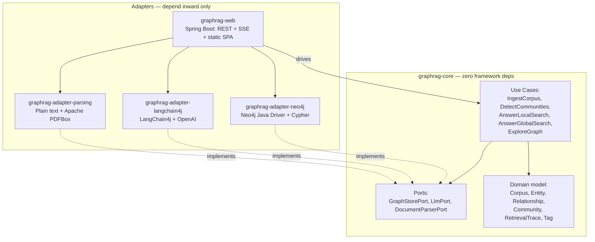
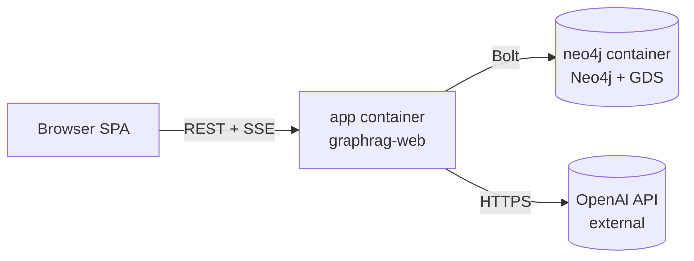

# Architecture Spine — GraphRAG Lens

## Design Paradigm

**Hexagonal Architecture (Ports & Adapters).** `graphrag-core` holds the domain model and use cases (ingest a Corpus, extract Entities/Relationships, detect Communities, answer via Local Search, answer via Global Search, explore the graph) and depends only on port interfaces it defines itself (`LlmPort`, `GraphStorePort`, `DocumentParserPort`). Every framework- or library-specific concern — Spring, the Neo4j driver, LangChain4j, PDFBox — lives in an adapter module that implements a port. `graphrag-web` is one more adapter: it drives the core's use cases from HTTP/SSE and renders results, but contains no domain logic itself.

This paradigm is chosen directly for the brief's "library-in-mind" goal: `graphrag-core` is the exact seam along which a future standalone Java GraphRAG library gets extracted, without a rewrite.



## Invariants & Rules

### AD-1 — Core has zero framework dependency

- **Binds:** `graphrag-core` (all use cases and domain types).
- **Prevents:** Domain logic becoming inseparable from Spring/Neo4j/LangChain4j, defeating the future-library extraction goal.
- **Rule:** `graphrag-core` compiles against plain Java plus its own port interfaces only. No import of Spring, the Neo4j driver, LangChain4j, or PDFBox types anywhere in `graphrag-core`.

### AD-2 — Neo4j access is driver + Cypher only

- **Binds:** `graphrag-adapter-neo4j` (implements `GraphStorePort`).
- **Prevents:** Two contributors picking incompatible persistence styles (one OGM-mapped, one raw Cypher), and Spring Data Neo4j's object mapping fighting the raw GDS/Cypher traversal this app needs.
- **Rule:** All Neo4j access goes through the plain Neo4j Java Driver with hand-written Cypher. Spring Data Neo4j is never used.

### AD-3 — LLM access is port-only

- **Binds:** `graphrag-adapter-langchain4j` (implements `LlmPort`); all of `graphrag-core`.
- **Prevents:** LangChain4j- or OpenAI-specific types leaking outside one adapter, which would block a future provider swap.
- **Rule:** Only `graphrag-adapter-langchain4j` may import LangChain4j or OpenAI SDK types. Everything else calls `LlmPort`.

### AD-4 — Community-detection relationships are undirected

- **Binds:** Graph schema (`graphrag-core` domain model) and `graphrag-adapter-neo4j`'s GDS calls.
- **Prevents:** A directed-only relationship model silently breaking GDS Leiden, which requires undirected input.
- **Rule:** Relationships fed into GDS Leiden calls are projected as `UNDIRECTED`, regardless of how they're stored/directed elsewhere in the graph.

### AD-5 — Retrieval Traces are transient

- **Binds:** `AnswerLocalSearch`, `AnswerGlobalSearch` use cases; `graphrag-web`.
- **Prevents:** Ephemeral UI-replay data being written into Neo4j as graph nodes, polluting the Knowledge Graph with non-domain state.
- **Rule:** A Retrieval Trace is held in memory, scoped to its query/answer, and is never persisted to Neo4j. Restarting the app loses in-flight traces; that's acceptable (PRD: no fallback/safety-net ethos).

### AD-6 — Detection always runs; the toggle only gates its animation

- **Binds:** `DetectCommunities` use case (FR-6); `graphrag-web`'s community-visualization toggle (FR-7).
- **Prevents:** The toggle being implemented as a gate on whether/when detection *executes*, contradicting the PRD's explicit FR-6/FR-7 split.
- **Rule:** `DetectCommunities` runs automatically and asynchronously immediately after Knowledge Graph construction completes, unconditionally. The toggle is read only by the presentation layer, to decide whether to animate/render that step — never passed into the use case itself.

### AD-7 — Server push is SSE, not WebSocket

- **Binds:** `graphrag-web`; the frontend SPA.
- **Prevents:** Two real-time transports (SSE and WebSocket) coexisting for what is, everywhere in this app, a one-way server→client concern.
- **Rule:** Live ingestion/construction/detection progress is pushed via Server-Sent Events (`SseEmitter`). WebSocket is not introduced anywhere in v1 — there is no client→server real-time need (Retrieval Trace Replay is post-hoc per PRD FR-13, not live).

### AD-8 — Deployment is exactly two containers

- **Binds:** Docker Compose topology (PRD FR-14).
- **Prevents:** A third frontend-dev-server container creeping in and breaking the one-command-setup requirement.
- **Rule:** `docker-compose.yml` defines exactly two services: `app` (the Spring Boot jar, serving REST + SSE + the pre-built static SPA from its own classpath) and `neo4j` (Community Edition, GDS plugin enabled). The frontend is never its own service/container.

### AD-9 — File-type support is adapter-scoped

- **Binds:** `graphrag-adapter-parsing` (implements `DocumentParserPort`); FR-1/FR-2.
- **Prevents:** A future file type (explicitly a Non-Goal for v1, but named as a "maybe later" in the brief) requiring changes to `graphrag-core`'s ingestion use case.
- **Rule:** Each supported file type (plain text, PDF via Apache PDFBox) is one adapter class implementing `DocumentParserPort`. `IngestCorpus` calls the port, never a concrete parser.

## Consistency Conventions

| Concern | Convention |
| --- | --- |
| Naming (entities, files, interfaces, events) | Domain nouns match the PRD Glossary exactly (Corpus, Entity, Relationship, Community, Tag, RetrievalTrace) — no synonyms in code. Ports are named `<Noun>Port` (e.g. `GraphStorePort`); adapters `<Tech><Port-without-suffix>Adapter` (e.g. `Neo4jGraphStoreAdapter`). Use cases are verb-first (`IngestCorpus`, `DetectCommunities`, `AnswerLocalSearch`). |
| Data & formats (ids, dates, error shapes) | Entity/Relationship/Community ids are Neo4j-generated internal ids surfaced to the API as opaque strings — never re-used as a public contract outside this app. API error responses are a single consistent JSON shape (`{"error": "<plain-language message>"}`) matching the PRD's "always surface visibly, never silently fail" NFR (FR-5, FR-9/FR-10). |
| State & cross-cutting (mutation, errors, config, logging) | Neo4j is the single source of truth for Corpus/Entity/Relationship/Community state. Config (OpenAI API key) is environment-variable only (PRD FR-15) — no config file, no in-app settings UI. LLM-call failures (extraction or generation) surface as a visible error and are logged; never retried automatically (AD tied to PRD's accepted-risk NFR). |

## Stack

| Name | Version |
| --- | --- |
| Java | 25 (LTS) |
| Spring Boot | 4.1.x (Spring Framework 7) |
| LangChain4j | 1.19.x |
| Neo4j | 2026.x, Community Edition, with Graph Data Science (GDS) plugin |
| Neo4j Java Driver | 6.1.x |
| Apache PDFBox | 3.0.x |
| Cytoscape.js | current (frontend graph canvas) |
| Docker / Docker Compose | current |

## Structural Seed

```text
graphrag-lens/
  graphrag-core/                  # domain + use cases + ports — zero framework deps
    src/main/java/.../domain/     # Corpus, Entity, Relationship, Community, RetrievalTrace, Tag
    src/main/java/.../usecase/    # IngestCorpus, DetectCommunities, AnswerLocalSearch, AnswerGlobalSearch, ExploreGraph
    src/main/java/.../port/       # GraphStorePort, LlmPort, DocumentParserPort
  graphrag-adapter-neo4j/         # implements GraphStorePort (driver + Cypher + GDS calls)
  graphrag-adapter-langchain4j/   # implements LlmPort (LangChain4j + OpenAI)
  graphrag-adapter-parsing/       # implements DocumentParserPort (plain text, PDFBox)
  graphrag-web/                   # Spring Boot: REST + SSE controllers, wires adapters into core, serves built SPA
    src/main/resources/static/    # built frontend output lands here
  frontend/                       # TypeScript + Cytoscape.js SPA (built separately, copied into graphrag-web)
  docker-compose.yml              # exactly two services: app, neo4j
```



Single environment: a developer's own machine, via `docker-compose up`. No staging/production environment exists or is planned for v1 (PRD: single-user, local-only). Observability is deliberately minimal — application logs to console only; no metrics/tracing infrastructure — appropriate to a solo hobby project's actual operational needs, not an oversight.

## Capability → Architecture Map

| Capability / Area | Lives in | Governed by |
| --- | --- | --- |
| Document Ingestion (FR-1–FR-3) | `graphrag-adapter-parsing`, `IngestCorpus` use case | AD-9 |
| Knowledge Graph Construction (FR-4–FR-5) | `IngestCorpus` use case, `LlmPort`, `graphrag-adapter-langchain4j` | AD-1, AD-3 |
| Community Detection & Visualization (FR-6–FR-7) | `DetectCommunities` use case, `graphrag-adapter-neo4j` (GDS Leiden) | AD-4, AD-6 |
| Query Interface (FR-8–FR-11) | `AnswerLocalSearch`, `AnswerGlobalSearch` use cases | AD-1, AD-3 |
| Retrieval Trace & Playback (FR-12–FR-13) | Use cases (trace capture) + `graphrag-web` (in-memory store, replay API) | AD-5 |
| Setup & Deployment (FR-14–FR-15) | `docker-compose.yml`, `graphrag-web` config | AD-8, Consistency Conventions (config) |
| Graph Exploration (FR-16–FR-17) | `ExploreGraph` use case, `graphrag-adapter-neo4j` | AD-1, AD-2 |
| Live ingestion progress (EXPERIENCE.md State Patterns) | `graphrag-web` SSE endpoints | AD-7 |

## Deferred

- **Authentication/authorization** — explicit Non-Goal (PRD: single-user, local-only). Needs its own architecture pass if the project ever grows beyond one user.
- **Multi-tenancy / hosted deployment** — same reason; deferred alongside auth.
- **Graph databases other than Neo4j** — explicit PRD Non-Goal; `GraphStorePort` makes this theoretically swappable later, but no second adapter is planned or designed against now.
- **Formal retrieval-quality benchmarking/evaluation infrastructure** — explicit PRD Non-Goal.
- **Observability/monitoring beyond console logs** — deliberately out of scope; revisit only if the library-extraction goal (brief Vision) gains other users.
- **Exact in-memory Retrieval Trace store implementation** (a `ConcurrentHashMap`-backed bean vs. a small cache library like Caffeine) — either is compatible with AD-5; low-stakes enough to leave to implementation.
- **Build tool** `[ASSUMPTION]` — Maven multi-module assumed as a conventional default for this module layout; Gradle would work equally well. Low-stakes, correct in review if you have a preference.
- **Frontend build wiring** `[ASSUMPTION]` — a TypeScript + Vite SPA built to static assets and copied into `graphrag-web`'s classpath (e.g. via `frontend-maven-plugin` or a manual build step) assumed to satisfy AD-8's two-container constraint without hand-authoring vanilla JS. Exact tooling is implementation detail.
- **Packaging/publishing `graphrag-core` as a standalone library** — explicit brief/PRD future goal, not a v1 deliverable; this spine's module boundary (AD-1) is what makes it possible later, but the actual extraction (versioning, publishing, public API stability) is out of scope now.
