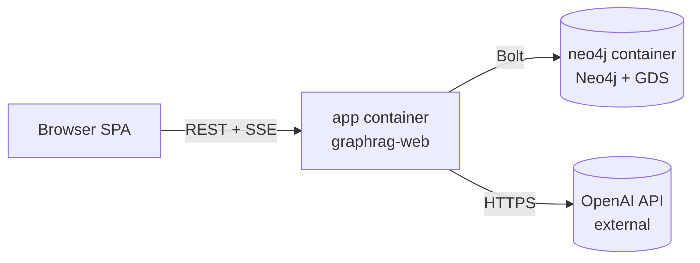
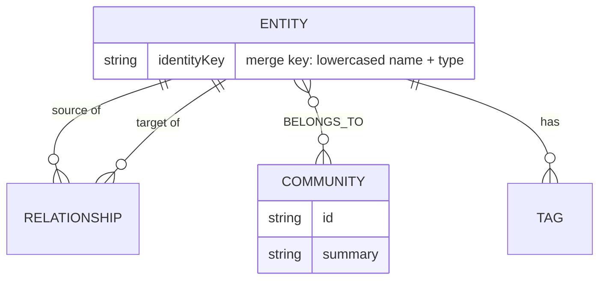

# Architecture Spine — GraphRAG Lens

## Design Paradigm

**Hexagonal Architecture (Ports & Adapters).** `graphrag-core` holds the domain model and use cases (ingest a Corpus, extract Entities/Relationships, detect Communities, answer via Local Search, answer via Global Search, explore the graph) and depends only on port interfaces it defines itself (`LlmPort`, `GraphStorePort`, `DocumentParserPort`). Every framework- or library-specific concern — Spring, the Neo4j driver, LangChain4j, PDFBox — lives in an adapter module that implements a port. `graphrag-web` is one more adapter: it drives the core's use cases from HTTP/SSE and renders results, but contains no domain logic itself.

This paradigm is chosen directly for the brief's "library-in-mind" goal: `graphrag-core` is the exact seam along which a future standalone Java GraphRAG library gets extracted, without a rewrite.


## Invariants & Rules

### AD-1 — Core has zero framework dependency

- **Binds:** `graphrag-core` (all use cases and domain types).
- **Prevents:** Domain logic becoming inseparable from Spring/Neo4j/LangChain4j, defeating the future-library extraction goal.
- **Rule:** `graphrag-core` compiles against plain Java plus its own port interfaces only. No import of Spring, the Neo4j driver, LangChain4j, or PDFBox types anywhere in `graphrag-core`.

### AD-2 — Neo4j access is driver + Cypher only

- **Binds:** `graphrag-adapter-neo4j` (implements `GraphStorePort`).
- **Prevents:** Two contributors picking incompatible persistence styles (one OGM-mapped, one raw Cypher), and Spring Data Neo4j's object mapping fighting the raw GDS/Cypher traversal this app needs.
- **Rule:** All Neo4j access goes through the plain Neo4j Java Driver with hand-written Cypher. Spring Data Neo4j is never used. (Spring's `Neo4jClient` — raw Cypher under Spring-managed transactions, without SDN's object mapping — was considered as a middle ground; rejected only for simplicity, since the driver alone is sufficient for a single-module persistence layer with no other Spring-transaction-scoped work to coordinate with.)

### AD-3 — LLM access is port-only

- **Binds:** `graphrag-adapter-langchain4j` (implements `LlmPort`); all of `graphrag-core`.
- **Prevents:** LangChain4j- or OpenAI-specific types leaking outside one adapter, which would block a future provider swap.
- **Rule:** Only `graphrag-adapter-langchain4j` may import LangChain4j or OpenAI SDK types. Everything else calls `LlmPort`.

### AD-4 — Community-detection relationships are undirected

- **Binds:** Graph schema (`graphrag-core` domain model) and `graphrag-adapter-neo4j`'s GDS calls.
- **Prevents:** A directed-only relationship model silently breaking GDS Leiden, which requires undirected input.
- **Rule:** Relationships fed into GDS Leiden calls are projected as `UNDIRECTED`, regardless of how they're stored/directed elsewhere in the graph.

### AD-5 — Retrieval Traces are transient and individually addressed

- **Binds:** `AnswerLocalSearch`, `AnswerGlobalSearch` use cases; `graphrag-web`.
- **Prevents:** Ephemeral UI-replay data being written into Neo4j as graph nodes; a "single current trace" design that clobbers concurrent or sequential queries.
- **Rule:** A Retrieval Trace is held in memory, keyed by a UUID `traceId` generated when the answer is produced and returned alongside it. It is an ordered sequence of steps — each step naming the Entity, Relationship, or Community touched at that point — never an unordered set or a single aggregate result, since Replay's scrub/step controls (PRD FR-13) are meaningless without a fixed step order. Replay is fetched by that id (`GET /api/traces/{traceId}`), never a single ambient "current trace" slot. Traces are never persisted to Neo4j; restarting the app loses in-flight traces (PRD: no fallback/safety-net ethos).

### AD-6 — Detection and summary generation always run; the toggle only gates animation

- **Binds:** `DetectCommunities` use case (FR-6); `AnswerGlobalSearch` (FR-10); `graphrag-web`'s community-visualization toggle (FR-7).
- **Prevents:** The toggle gating whether/when detection *executes* (contradicting the PRD's FR-6/FR-7 split); Global Search generating community summaries lazily and on-demand, which would make answer latency and summary existence depend on query order.
- **Rule:** `DetectCommunities` runs automatically and asynchronously immediately after Knowledge Graph construction completes, unconditionally — and as part of that same run, generates and persists each Community's summary (via `LlmPort`) onto its `(:Community)` node (AD-11). `AnswerGlobalSearch` only reads existing summaries; it never generates one on demand. The visualization toggle is read only by the frontend, to decide whether to animate/render the step and its SSE events — the backend has no knowledge of the toggle's state at all, and emits the same progress events regardless.

### AD-7 — Server push is SSE, not WebSocket

- **Binds:** `graphrag-web`; the frontend SPA.
- **Prevents:** Two real-time transports (SSE and WebSocket) coexisting for what is, everywhere in this app, a one-way server→client concern.
- **Rule:** Live ingestion/construction/detection progress is pushed via Server-Sent Events (`SseEmitter`). WebSocket is not introduced anywhere in v1 — there is no client→server real-time need (Retrieval Trace Replay is post-hoc per PRD FR-13, not live).

### AD-8 — Deployment is exactly two containers

- **Binds:** Docker Compose topology (PRD FR-14).
- **Prevents:** A third frontend-dev-server container creeping in and breaking the one-command-setup requirement.
- **Rule:** `docker-compose.yml` defines exactly two services: `app` (the Spring Boot jar, serving REST + SSE + the Thymeleaf-rendered pages and static JS from its own classpath) and `neo4j` (Community Edition, GDS plugin enabled). The frontend is never its own service/container.

### AD-9 — File-type support is adapter-scoped, dispatched by the adapter itself

- **Binds:** `graphrag-adapter-parsing` (implements `DocumentParserPort`); FR-1/FR-2.
- **Prevents:** A future file type (explicitly a Non-Goal for v1, but named as a "maybe later" in the brief) requiring changes to `graphrag-core`'s ingestion use case; file-type-selection knowledge leaking into `graphrag-web` via framework-level wiring (e.g. Spring `@Qualifier`/bean-name dispatch), which would undermine the isolation this AD exists for.
- **Rule:** Each supported file type (plain text, PDF via Apache PDFBox) is one adapter class implementing `DocumentParserPort`, exposing its own `supports(filename): boolean`. A core-owned dispatcher (injected with all available parser adapters) selects the matching one by calling `supports()` — `graphrag-web` never wires a specific parser by type or name.

### AD-10 — Entities are deduplicated by identity, never blind-created

- **Binds:** `IngestCorpus` use case; `graphrag-adapter-neo4j`.
- **Prevents:** The same real-world entity, mentioned multiple times across a Corpus (or across repeated LLM extraction calls), producing multiple Entity nodes — which would silently degrade Community detection (FR-6) and Explore-page structure (FR-16) depending purely on which contributor wrote the write path.
- **Rule:** Entity writes use Cypher `MERGE` keyed on a normalized identity (lowercased name + entity type), never a blind `CREATE`. The same identity key always resolves to the same node within a Corpus.

### AD-11 — Communities are first-class nodes, not a scalar property

- **Binds:** `DetectCommunities`, `AnswerGlobalSearch` use cases; `graphrag-adapter-neo4j`; FR-6/FR-7/FR-10/FR-16.
- **Prevents:** A `communityId` scalar property on Entity nodes (which cannot hold a per-community summary, and gives Explore/FR-16 nothing to query directly) coexisting with, or being chosen instead of, real Community nodes.
- **Rule:** Each detected Community is written as its own `(:Community {id, summary})` node, related to its member Entities via `[:BELONGS_TO]` relationships. `AD-4`'s undirected projection for GDS Leiden governs the *input* to detection; this AD governs the *output* written back to the graph.

### AD-12 — Progress is one multiplexed SSE stream per Corpus, with a fixed event envelope

- **Binds:** `graphrag-web`; the frontend SPA; AD-7.
- **Prevents:** Two independently-built halves (backend emitter, frontend consumer) agreeing on "SSE, not WebSocket" (AD-7) while using mutually unconsumable event shapes — e.g. one bare endpoint per progress type vs. a single multiplexed stream.
- **Rule:** All ingestion/construction/detection progress for one Corpus is pushed over a single stream, `GET /api/corpora/{corpusId}/progress`, as named SSE events (e.g. `entity-extracted`, `community-detected`, `ingestion-complete`, `error`), each with a `{"type": "<event-name>", "data": {...}}` JSON payload. No second progress endpoint is introduced.

### AD-13 — Query has one request/response contract, covering answer, no-answer, and failure

- **Binds:** `AnswerLocalSearch`, `AnswerGlobalSearch` use cases; `graphrag-web`; FR-8–FR-11.
- **Prevents:** An independently-built frontend and backend agreeing on *which* use case runs (Local vs. Global, AD from FR-9/FR-10) but not on the wire shape of the result — in particular, "no answer found" (a normal, expected outcome per FR-9/FR-10) being conflated with an actual LLM failure (FR-5's error state), since both would otherwise land on the same generic `{"error": ...}` shape.
- **Rule:** A query is `POST /api/corpora/{corpusId}/query` with body `{"question": "...", "mode": "LOCAL" | "GLOBAL"}`. A successful answer responds `{"answerId": "...", "traceId": "...", "answer": "..."}`. A "no answer found" result (FR-9/FR-10 consequence) is a distinct, successful response shape — `{"answerId": "...", "traceId": "...", "noAnswer": true, "reason": "..."}` — never the generic error shape. An actual LLM-call failure during generation (FR-5's principle, extended per AD-6's Component Patterns note) uses the same `{"error": "<plain-language message>"}` shape as extraction failures, and is also emitted as an `error` event on that Corpus's AD-12 SSE stream so a still-open connection sees it without polling.

### AD-14 — Query reads run against whatever is currently committed; no locking against in-flight ingestion

- **Binds:** `AnswerLocalSearch`, `AnswerGlobalSearch`, `ExploreGraph` use cases; `graphrag-adapter-neo4j`; FR-8–FR-11, FR-16–FR-17.
- **Prevents:** An implementer introducing a lock, queue, or "wait for ingestion to finish" gate on queries — which would silently contradict EXPERIENCE.md's explicit allowance for querying mid-ingestion (a deliberate "real, non-scripted" choice, not an oversight to guard against).
- **Rule:** Every Entity/Relationship/Community write (AD-10, AD-11) commits in its own Neo4j transaction as soon as extracted/detected — never batched into one Corpus-wide transaction. A query never waits for or blocks on in-flight ingestion; it simply reads whatever is currently committed, which may be a partial graph. No additional locking or coordination is introduced between the write path and the read path.

### AD-15 — Frontend is Java-native: Thymeleaf shell, unbundled JS for the canvas

- **Binds:** `graphrag-web`; the whole frontend delivery approach; overrides the earlier TypeScript+Vite assumption.
- **Prevents:** A second build toolchain (Node/npm/a bundler) creeping into a project explicitly meant to stay Java-native; a contributor assuming a compile step exists for client JS when none does.
- **Rule:** The page shell (layout, chat panel scaffolding, toggles, initial state) is server-rendered via Thymeleaf templates in `graphrag-web/src/main/resources/templates/`. Cytoscape.js and any other client-side JavaScript (the graph canvas, replay scrubber, SSE consumption) are plain, unbundled `.js` files under `graphrag-web/src/main/resources/static/js/` — vendored or CDN-loaded, never TypeScript, never passed through a bundler. There is no `frontend/` module, no `package.json`-driven build step anywhere in the project.

## Consistency Conventions

| Concern | Convention |
| --- | --- |
| Naming (entities, files, interfaces, events) | Domain nouns match the PRD Glossary exactly (Corpus, Entity, Relationship, Community, Tag, RetrievalTrace) — no synonyms in code. Ports are named `<Noun>Port` (e.g. `GraphStorePort`); adapters `<Tech><Port-without-suffix>Adapter` (e.g. `Neo4jGraphStoreAdapter`). Use cases are verb-first (`IngestCorpus`, `DetectCommunities`, `AnswerLocalSearch`). |
| Data & formats (ids, dates, error shapes) | Entity/Relationship/Community ids are Neo4j-generated internal ids surfaced to the API as opaque strings — never re-used as a public contract outside this app. API error responses are a single consistent JSON shape (`{"error": "<plain-language message>"}`) matching the PRD's "always surface visibly, never silently fail" NFR (FR-5, FR-9/FR-10). |
| State & cross-cutting (mutation, errors, config, logging) | Neo4j is the single source of truth for Corpus/Entity/Relationship/Community state. Config (OpenAI API key) is environment-variable only (PRD FR-15) — no config file, no in-app settings UI. LLM-call failures (extraction or generation) surface as a visible error and are logged; never retried automatically (AD tied to PRD's accepted-risk NFR). |

## Stack

| Name | Version |
| --- | --- |
| Java | 25 (LTS) |
| Spring Boot | 4.1.x (Spring Framework 7) |
| Thymeleaf | current (bundled with Spring Boot's `spring-boot-starter-thymeleaf`) |
| LangChain4j | latest at implementation start (≥1.20.x — biweekly release cadence, don't hard-pin from this document) |
| Neo4j | 2026.x, Community Edition, with Graph Data Science (GDS) plugin |
| Neo4j Java Driver | latest at implementation start (≥6.2.x — ships frequently, don't hard-pin from this document) |
| Apache PDFBox | 3.0.x |
| Cytoscape.js | current (frontend graph canvas) |
| Docker / Docker Compose | current |

## Structural Seed

```text
graphrag-lens/
  graphrag-core/                  # domain + use cases + ports — zero framework deps
    src/main/java/.../domain/     # Corpus, Entity, Relationship, Community, RetrievalTrace, Tag
    src/main/java/.../usecase/    # IngestCorpus, DetectCommunities, AnswerLocalSearch, AnswerGlobalSearch, ExploreGraph
    src/main/java/.../port/       # GraphStorePort, LlmPort, DocumentParserPort
  graphrag-adapter-neo4j/         # implements GraphStorePort (driver + Cypher + GDS calls)
  graphrag-adapter-langchain4j/   # implements LlmPort (LangChain4j + OpenAI)
  graphrag-adapter-parsing/       # implements DocumentParserPort (plain text, PDFBox)
  graphrag-web/                   # Spring Boot: REST + SSE controllers, wires adapters into core
    src/main/resources/templates/ # Thymeleaf page shell (server-rendered)
    src/main/resources/static/js/ # plain, unbundled JS: Cytoscape.js canvas, scrubber, SSE consumption
  docker-compose.yml              # exactly two services: app, neo4j
```



Single environment: a developer's own machine, via `docker-compose up`. No staging/production environment exists or is planned for v1 (PRD: single-user, local-only). Observability is deliberately minimal — application logs to console only; no metrics/tracing infrastructure — appropriate to a solo hobby project's actual operational needs, not an oversight.

Neo4j graph schema (per AD-10, AD-11 — names and relationships only, not a full property list):



Corpus and RetrievalTrace are not modeled as Neo4j nodes: a Corpus is a batch of ingested documents (its identity lives in `graphrag-web`, not the graph), and a Retrieval Trace is transient, addressed by `traceId` (AD-5), never persisted.

## Capability → Architecture Map

| Capability / Area | Lives in | Governed by |
| --- | --- | --- |
| Document Ingestion (FR-1–FR-3) | `graphrag-adapter-parsing`, `IngestCorpus` use case | AD-9 |
| Knowledge Graph Construction (FR-4–FR-5) | `IngestCorpus` use case, `LlmPort`, `graphrag-adapter-langchain4j` | AD-1, AD-3, AD-10 |
| Community Detection & Visualization (FR-6–FR-7) | `DetectCommunities` use case, `graphrag-adapter-neo4j` (GDS Leiden) | AD-4, AD-6, AD-11 |
| Query Interface (FR-8–FR-11) | `AnswerLocalSearch`, `AnswerGlobalSearch` use cases | AD-1, AD-3, AD-6, AD-11, AD-13, AD-14 |
| Retrieval Trace & Playback (FR-12–FR-13) | Use cases (trace capture) + `graphrag-web` (in-memory store, replay API) | AD-5, AD-13 |
| Setup & Deployment (FR-14–FR-15) | `docker-compose.yml`, `graphrag-web` config | AD-8, Consistency Conventions (config) |
| Graph Exploration (FR-16–FR-17) | `ExploreGraph` use case, `graphrag-adapter-neo4j` | AD-1, AD-2, AD-11, AD-14 |
| Live ingestion progress (EXPERIENCE.md State Patterns) | `graphrag-web` SSE endpoints | AD-7, AD-12 |

## Deferred

- **UI tone/visual identity** (PRD Cross-Cutting NFR) — intentionally not this spine's concern; it's fully owned by `DESIGN.md`/`EXPERIENCE.md`, which this spine treats as sources but doesn't duplicate. Not a silent omission.
- **Authentication/authorization** — explicit Non-Goal (PRD: single-user, local-only). Needs its own architecture pass if the project ever grows beyond one user.
- **Multi-tenancy / hosted deployment** — same reason; deferred alongside auth.
- **Graph databases other than Neo4j** — explicit PRD Non-Goal; `GraphStorePort` makes this theoretically swappable later, but no second adapter is planned or designed against now.
- **Formal retrieval-quality benchmarking/evaluation infrastructure** — explicit PRD Non-Goal.
- **Observability/monitoring beyond console logs** — deliberately out of scope; revisit only if the library-extraction goal (brief Vision) gains other users.
- **Exact in-memory Retrieval Trace store implementation** (a `ConcurrentHashMap`-backed bean vs. a small cache library like Caffeine) — either is compatible with AD-5; low-stakes enough to leave to implementation.
- **Build tool** — Maven multi-module, confirmed.
- **Exact Cytoscape.js loading mechanism** (vendored file checked into `static/js/` vs. CDN `<script>` tag in the Thymeleaf template) — either satisfies AD-15; low-stakes implementation detail.
- **Packaging/publishing `graphrag-core` as a standalone library** — explicit brief/PRD future goal, not a v1 deliverable; this spine's module boundary (AD-1) is what makes it possible later, but the actual extraction (versioning, publishing, public API stability) is out of scope now.
