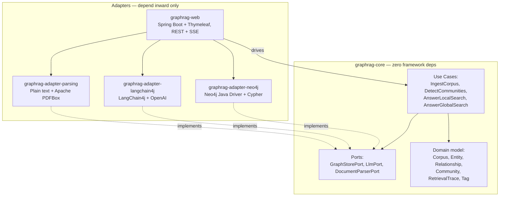
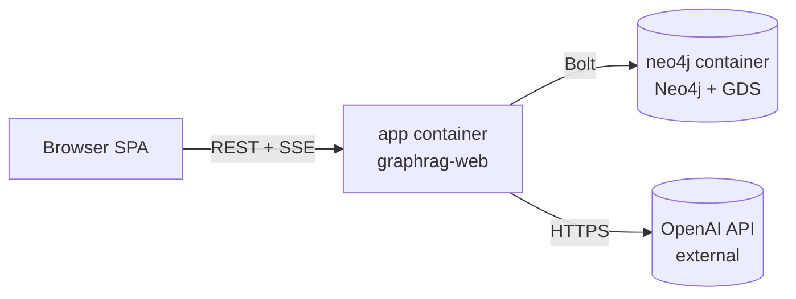
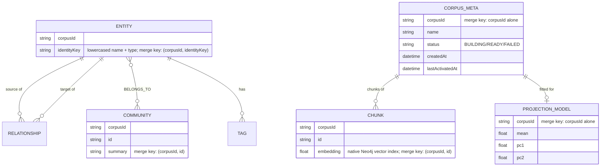

# Architecture Spine — GraphRAG Lens

## Design Paradigm

**Hexagonal Architecture (Ports & Adapters).** `graphrag-core` holds the domain model and use cases (ingest a Corpus, extract Entities/Relationships, detect Communities, answer via Local Search, answer via Global Search, explore the graph) and depends only on port interfaces it defines itself (`LlmPort`, `GraphStorePort`, `DocumentParserPort`). Every framework- or library-specific concern — Spring, the Neo4j driver, LangChain4j, PDFBox — lives in an adapter module that implements a port. `graphrag-web` is one more adapter: it drives the core's use cases from HTTP/SSE and renders results, but contains no domain logic itself.

This paradigm is chosen directly for the brief's "library-in-mind" goal: `graphrag-core` is the exact seam along which a future standalone Java GraphRAG library gets extracted, without a rewrite.



## Invariants & Rules

### AD-1 — Core has zero framework dependency

- **Binds:** `graphrag-core` (all use cases and domain types).
- **Prevents:** Domain logic becoming inseparable from Spring/Neo4j/LangChain4j, defeating the future-library extraction goal.
- **Rule:** `graphrag-core` compiles against plain Java plus its own port interfaces only. No import of Spring, the Neo4j driver, LangChain4j, or PDFBox types anywhere in `graphrag-core`.

### AD-2 — Neo4j access is driver + Cypher only

- **Binds:** `graphrag-adapter-neo4j` (implements `GraphStorePort`).
- **Prevents:** Two contributors picking incompatible persistence styles (one OGM-mapped, one raw Cypher), and Spring Data Neo4j's object mapping fighting the raw GDS/Cypher traversal this app needs.
- **Rule:** All Neo4j access goes through the plain Neo4j Java Driver with hand-written Cypher. Spring Data Neo4j is never used. (Spring's `Neo4jClient` — raw Cypher under Spring-managed transactions, without SDN's object mapping — was considered as a middle ground; rejected only for simplicity, since the driver alone is sufficient for a single-module persistence layer with no other Spring-transaction-scoped work to coordinate with.)

### AD-3 — LLM access is port-only

- **Binds:** `graphrag-adapter-langchain4j` (implements `LlmPort`); all of `graphrag-core`.
- **Prevents:** LangChain4j- or OpenAI-specific types leaking outside one adapter, which would block a future provider swap.
- **Rule:** Only `graphrag-adapter-langchain4j` may import LangChain4j or OpenAI SDK types. Everything else calls `LlmPort`.

### AD-4 — Community-detection relationships are undirected

- **Binds:** Graph schema (`graphrag-core` domain model) and `graphrag-adapter-neo4j`'s GDS calls.
- **Prevents:** A directed-only relationship model silently breaking GDS Leiden, which requires undirected input.
- **Rule:** Relationships fed into GDS Leiden calls are projected as `UNDIRECTED`, regardless of how they're stored/directed elsewhere in the graph.

### AD-5 — Retrieval Traces are transient and individually addressed

- **Binds:** `AnswerLocalSearch`, `AnswerGlobalSearch` use cases; `graphrag-web`.
- **Prevents:** Ephemeral UI-replay data being written into Neo4j as graph nodes; a "single current trace" design that clobbers concurrent or sequential queries.
- **Rule:** A Retrieval Trace is held in memory, keyed by a UUID `traceId` generated when the answer is produced and returned alongside it. It is an ordered sequence of steps — each step naming the Entity, Relationship, or Community touched at that point — never an unordered set or a single aggregate result, since Replay's scrub/step controls (PRD FR-13) are meaningless without a fixed step order. Replay is fetched by that id (`GET /api/traces/{traceId}`), never a single ambient "current trace" slot. Traces are never persisted to Neo4j; restarting the app loses in-flight traces (PRD: no fallback/safety-net ethos).

### AD-6 — Detection and summary generation always run; the toggle only gates animation

- **Binds:** `DetectCommunities` use case (FR-6); `AnswerGlobalSearch` (FR-10); `graphrag-web`'s community-visualization toggle (FR-7).
- **Prevents:** The toggle gating whether/when detection *executes* (contradicting the PRD's FR-6/FR-7 split); Global Search generating community summaries lazily and on-demand, which would make answer latency and summary existence depend on query order.
- **Rule:** `DetectCommunities` runs automatically and asynchronously immediately after Knowledge Graph construction completes, unconditionally — and as part of that same run, generates and persists each Community's summary (via `LlmPort`) onto its `(:Community)` node (AD-11). `AnswerGlobalSearch` only reads existing summaries; it never generates one on demand. The visualization toggle is read only by the frontend, to decide whether to animate/render the step and its SSE events — the backend has no knowledge of the toggle's state at all, and emits the same progress events regardless.

### AD-7 — Server push is SSE, not WebSocket

- **Binds:** `graphrag-web`; the frontend SPA.
- **Prevents:** Two real-time transports (SSE and WebSocket) coexisting for what is, everywhere in this app, a one-way server→client concern.
- **Rule:** Live ingestion/construction/detection progress is pushed via Server-Sent Events (`SseEmitter`). WebSocket is not introduced anywhere in v1 — there is no client→server real-time need (Retrieval Trace Replay is post-hoc per PRD FR-13, not live).

### AD-8 — Deployment is exactly two containers

- **Binds:** Docker Compose topology (PRD FR-14).
- **Prevents:** A third frontend-dev-server container creeping in and breaking the one-command-setup requirement.
- **Rule:** `docker-compose.yml` defines exactly two services: `app` (the Spring Boot jar, serving REST + SSE + the Thymeleaf-rendered pages and static JS from its own classpath) and `neo4j` (Community Edition, GDS plugin enabled). The frontend is never its own service/container.

### AD-9 — File-type support is adapter-scoped, dispatched by the adapter itself

- **Binds:** `graphrag-adapter-parsing` (implements `DocumentParserPort`); FR-1/FR-2.
- **Prevents:** A future file type (explicitly a Non-Goal for v1, but named as a "maybe later" in the brief) requiring changes to `graphrag-core`'s ingestion use case; file-type-selection knowledge leaking into `graphrag-web` via framework-level wiring (e.g. Spring `@Qualifier`/bean-name dispatch), which would undermine the isolation this AD exists for.
- **Rule:** Each supported file type (plain text, PDF via Apache PDFBox) is one adapter class implementing `DocumentParserPort`, exposing its own `supports(filename): boolean`. A core-owned dispatcher (injected with all available parser adapters) selects the matching one by calling `supports()` — `graphrag-web` never wires a specific parser by type or name.

### AD-10 — Entities are deduplicated by identity, never blind-created

- **Binds:** `IngestCorpus` use case; `graphrag-adapter-neo4j`.
- **Prevents:** The same real-world entity, mentioned multiple times across a Corpus (or across repeated LLM extraction calls), producing multiple Entity nodes — which would silently degrade Community detection (FR-6) and graph-exploration structure (FR-16) depending purely on which contributor wrote the write path.
- **Rule:** Entity writes use Cypher `MERGE` keyed on a normalized identity (lowercased name + entity type), never a blind `CREATE`. The same identity key always resolves to the same node within a Corpus.

### AD-11 — Communities are first-class nodes, not a scalar property

- **Binds:** `DetectCommunities`, `AnswerGlobalSearch` use cases; `graphrag-adapter-neo4j`; FR-6/FR-7/FR-10/FR-16.
- **Prevents:** A `communityId` scalar property on Entity nodes (which cannot hold a per-community summary, and gives graph exploration/FR-16 nothing to query directly) coexisting with, or being chosen instead of, real Community nodes.
- **Rule:** Each detected Community is written as its own `(:Community {id, summary})` node, related to its member Entities via `[:BELONGS_TO]` relationships. `AD-4`'s undirected projection for GDS Leiden governs the *input* to detection; this AD governs the *output* written back to the graph.

### AD-12 — Progress is one multiplexed SSE stream per Corpus, with a fixed event envelope

- **Binds:** `graphrag-web`; the frontend SPA; AD-7.
- **Prevents:** Two independently-built halves (backend emitter, frontend consumer) agreeing on "SSE, not WebSocket" (AD-7) while using mutually unconsumable event shapes — e.g. one bare endpoint per progress type vs. a single multiplexed stream.
- **Rule:** All ingestion/construction/detection progress for one Corpus is pushed over a single stream, `GET /api/corpora/{corpusId}/progress`, as named SSE events (e.g. `entity-extracted`, `community-detected`, `ingestion-complete`, `error`), each with a `{"type": "<event-name>", "data": {...}}` JSON payload. No second progress endpoint is introduced.

### AD-13 — Query has one request/response contract, covering answer, no-answer, and failure

- **Binds:** `AnswerLocalSearch`, `AnswerGlobalSearch` use cases; `graphrag-web`; FR-8–FR-11.
- **Prevents:** An independently-built frontend and backend agreeing on *which* use case runs (Local vs. Global, AD from FR-9/FR-10) but not on the wire shape of the result — in particular, "no answer found" (a normal, expected outcome per FR-9/FR-10) being conflated with an actual LLM failure (FR-5's error state), since both would otherwise land on the same generic `{"error": ...}` shape.
- **Rule:** A query is `POST /api/corpora/{corpusId}/query` with body `{"question": "...", "mode": "LOCAL" | "GLOBAL"}`. A successful answer responds `{"answerId": "...", "traceId": "...", "answer": "..."}`. A "no answer found" result (FR-9/FR-10 consequence) is a distinct, successful response shape — `{"answerId": "...", "traceId": "...", "noAnswer": true, "reason": "..."}` — never the generic error shape. An actual LLM-call failure during generation (FR-5's principle, extended per AD-6's Component Patterns note) uses the same `{"error": "<plain-language message>"}` shape as extraction failures, and is also emitted as an `error` event on that Corpus's AD-12 SSE stream so a still-open connection sees it without polling.

### AD-14 — Query reads run against whatever is currently committed; no locking against in-flight ingestion

- **Binds:** `AnswerLocalSearch`, `AnswerGlobalSearch` use cases; `graphrag-adapter-neo4j`; FR-8–FR-11.
- **Prevents:** A read use case, once actually invoked, introducing a lock, queue, or wait against in-flight ingestion at the storage/read-path level. This is narrower than "a query is always accepted" — **reconciled 2026-09-20:** it originally read as a blanket guarantee that any query is always accepted regardless of Corpus state, which a later story reversed at the web layer (see AD-16). What this AD actually prevents, and still holds today, is the *use case itself* ever locking, queuing, or waiting on the write path once it runs.
- **Rule:** Every Entity/Relationship/Community write (AD-10, AD-11) commits in its own Neo4j transaction as soon as extracted/detected — never batched into one Corpus-wide transaction. Once a read use case is invoked, it never waits for or blocks on in-flight ingestion; it simply reads whatever is currently committed, which may be a partial graph. No additional locking or coordination exists between the write path and the read path. **Superseded for graph exploration (2026-09-20):** the `ExploreGraph` use case and its `GET /api/graph` endpoint, which this AD used to also bind (FR-16–FR-17), were removed when the former separate Explore page was merged into the main screen — pan/zoom/click exploration now reads directly off the Cytoscape elements the browser already holds from the AD-12 SSE stream, with no separate backend read at all, so no locking/gating question arises for it in the first place.

### AD-15 — Frontend is Java-native: Thymeleaf shell, unbundled JS for the canvas

- **Binds:** `graphrag-web`; the whole frontend delivery approach; overrides the earlier TypeScript+Vite assumption.
- **Prevents:** A second build toolchain (Node/npm/a bundler) creeping into a project explicitly meant to stay Java-native; a contributor assuming a compile step exists for client JS when none does.
- **Rule:** The page shell (layout, chat panel scaffolding, toggles, initial state) is server-rendered via Thymeleaf templates in `graphrag-web/src/main/resources/templates/`. Cytoscape.js and any other client-side JavaScript (the graph canvas, replay scrubber, SSE consumption) are plain, unbundled `.js` files under `graphrag-web/src/main/resources/static/js/` — vendored or CDN-loaded, never TypeScript, never passed through a bundler. There is no `frontend/` module, no `package.json`-driven build step anywhere in the project. **Test-only exception (added 2026-09-20):** `graphrag-web`'s test sources may depend on Playwright-Java (a Maven test-scope dependency; see `graphrag-web/pom.xml` and `src/test/java/.../ui/`) to drive a real headless browser for UI-behavior tests. Playwright-Java bundles a Node-based automation driver internally, but it is a test-runtime dependency invoked via `mvn test`, never an authoring or build step for the app's own JS — no `package.json`, no `npm install`, and no bundler is introduced into the shipped app or anywhere in the repository as a result.

### AD-16 — Corpus workflow status gates Query at the web layer (added 2026-09-20; amended 2026-09-28)

- **Binds:** `graphrag-web`'s `CorpusController`/corpus registry; FR-8–FR-11.
- **Prevents:** A presenter's LOCAL/GLOBAL question landing against a Corpus that hasn't finished ingesting (or that failed) and getting a confusing, partial, or misleading answer instead of a clear "still building" message mid-demo. This reverses this project's own original UX allowance — EXPERIENCE.md's now-superseded "queries proceed against a partial graph" decision, the same allowance AD-14 was originally written to protect (see AD-14's reconciliation note above) — a deliberate, accepted trade-off from the `spec-demo-ready-showcase-workflow.md` story, not an oversight.
- **Rule:** `CorpusController.query()` checks the corpus's status *before* invoking either use case. A `BUILDING` or `FAILED` Corpus responds `409 Conflict` with a plain-language message, and neither `AnswerLocalSearch` nor `AnswerGlobalSearch` is invoked at all — no use case call, no read, no partial answer. This gate lives entirely in `graphrag-web`, above the use-case boundary AD-14 governs: once a read use case *is* invoked (Corpus is `READY`), it remains exactly as lock-free and non-blocking as AD-14 specifies. Graph exploration (FR-16–FR-17) has no equivalent gate and needs none — since the 2026-09-20 Explore-into-main-screen merge it is pure client-side canvas interaction with elements already received via SSE (see AD-14's superseded note), never a server call this gate could apply to. **Amended 2026-09-28 (spec-neo4j-corpus-persistence):** the in-memory `CorpusStore` this rule originally cited is removed entirely (AD-19); every operation `CorpusController` used to perform against it (`put`/`markReady`/`markFailed`/`get`/`status`/`size`/`isOffline`/`markOffline`) now goes through `Neo4jCorpusRegistry` (`graphrag-adapter-neo4j`) instead, which persists the durable ones (all but the offline-id set, per AD-19) instead of holding them in a `ConcurrentHashMap`. The query gate's behavior is unchanged — only where the status is read from and how it's stored.

### AD-17 — Vector subsystem reuses existing adapters; no new container (added 2026-09-20, v1.1; amended 2026-09-28)

- **Binds:** New `EmbeddingPort`, `VectorStorePort` in `graphrag-core`; `AnswerVectorBaseline`, `ConstructVectorIndex` use cases; FR-19–FR-22.
- **Prevents:** A third data-store container (a dedicated vector DB) creeping in and violating AD-8's "exactly two containers" rule; LangChain4j/OpenAI or Neo4j-driver types leaking outside their existing adapter boundaries the way AD-3/AD-2 already prevent for LLM and graph access.
- **Rule:** `EmbeddingPort` is implemented by the *existing* `graphrag-adapter-langchain4j` (LangChain4j already wraps OpenAI embeddings — no new adapter module). `VectorStorePort` is implemented by the *existing* `graphrag-adapter-neo4j`, using Neo4j 2026.x's native vector index rather than a separate vector database — this is what keeps AD-8 intact. `ConstructVectorIndex` runs as its own step alongside `IngestCorpus` (chunk the Corpus, embed each chunk via `EmbeddingPort`, persist via `VectorStorePort`); it does not block or gate Entity/Relationship extraction, and vice versa. The 2D projection used by the Vector Space view (EXPERIENCE.md) is computed once during this step and persisted alongside the vectors — never recomputed per query. **Amended 2026-09-28 (spec-neo4j-corpus-persistence, first real implementation of this AD):** exactly one vector index spans every corpus's `Chunk` nodes — never one index per corpus, which would proliferate unboundedly since corpora are retained indefinitely (AD-20) — filtered by the `corpusId` property at query time via in-index filtering. **Correction, 2026-09-28 review:** Community Edition indexes a `LIST<FLOAT>` embedding property, not Enterprise/Aura's native `VECTOR` type — "vector index," not "native vector index." In-index filtering (`SEARCH ... WHERE`) reached general availability on Community Edition specifically as of 2026.04 (not 2026.01, which was Enterprise-only preview) — the same release that deprecated the older `db.index.vector.queryNodes`/`queryRelationships` procedures in favor of the Cypher `SEARCH` clause. Since `docker-compose.yml` pins `neo4j:2026.08.1-community` (well past 2026.04), the adapter must use the current `SEARCH`-clause syntax against a `LIST<FLOAT>` property. Sources: neo4j.com/docs/cypher-manual/current/indexes/semantic-indexes/vector-indexes/, community.neo4j.com/t/search-clause-with-where-in-community-edition-ga-status-and-supported-predicates-for-multi-tenant-filtering/78969. The fitted `ProjectionModel` is one `(:ProjectionModel {corpusId, mean, pc1, pc2})` node per corpus, MERGE-keyed on `corpusId` alone.

### AD-18 — Query mode and trace-step shape extend for DRIFT and the Vector Baseline (added 2026-09-20, v1.1)

- **Binds:** AD-13 (query contract); AD-5 (trace steps); `AnswerDriftSearch`, `AnswerVectorBaseline` use cases; FR-18, FR-21.
- **Prevents:** AD-13's mode enum and AD-5's step-kind set silently going stale as v1.1 adds real new modes/step kinds, without reopening or contradicting Epic 3/4/5's already-`review` stories built against the original AD-5/AD-13 text.
- **Rule:** AD-13's `mode` field extends to `"LOCAL" | "GLOBAL" | "DRIFT"`; response shapes (`answer` / `noAnswer` / `error`) are unchanged. AD-5's trace-step model extends with two new step kinds beyond "Entity, Relationship, or Community touched": a **sub-question-spawned** step (DRIFT only, carries the spawned question text and its parent community pass) and a **chunk-retrieved-via-similarity** step (Vector Baseline only, carries the chunk id and its similarity score). Both remain part of one ordered step sequence per AD-5's "never an unordered set" rule. The Vector Baseline's trace is a *separate* trace (its own `traceId`, per AD-5), never merged into the same trace as the GraphRAG answer it's compared against — the Compare CTA (EXPERIENCE.md) triggers a second, independent `AnswerVectorBaseline` call, not a mode branch inside the original query.

### AD-19 — Corpus registry persistence lives in `graphrag-adapter-neo4j`, but is not a `graphrag-core` port (added 2026-09-28)

- **Binds:** `graphrag-adapter-neo4j` (new `Neo4jCorpusRegistry`); `graphrag-web`'s `CorpusController`; supersedes `CorpusStore`.
- **Prevents:** Two incompatible ways this could otherwise go — (a) `graphrag-web` gaining its own direct Neo4j driver usage for corpus bookkeeping, splitting Neo4j access across two modules and undermining AD-2's single-module driver rule; or (b) corpus workflow status/activation-history bookkeeping (demo-app concerns, not GraphRAG-library concerns) leaking into `graphrag-core`'s port surface, forcing every future library consumer to implement a registry port they don't need.
- **Rule:** The `CorpusStore` class is deleted outright — there is no in-memory cache layer in front of Neo4j. `Neo4jCorpusRegistry` is its sole replacement: a plain Spring-managed class in `graphrag-adapter-neo4j` (*not* a `graphrag-core` port implementation) that persists `CorpusMeta` nodes (id, derived name, document filenames, workflow status, createdAt, lastActivatedAt) via the same Neo4j Java Driver used by `GraphStorePort`/`VectorStorePort`. `graphrag-web` calls it directly, the same way it calls other adapter-side Spring beans, for every operation `CorpusStore` used to serve (`put`/`markReady`/`markFailed`/`get`/`status`/`size`). The one thing `Neo4jCorpusRegistry` still holds in a plain in-process field, not in Neo4j, is the offline-corpus-id set: demo/offline corpora (`markOffline`, Story 9.1) are never written as `CorpusMeta` nodes, and that small transient set is lost on restart exactly as it is today — a deliberate, narrow exception to "no cache layer," not a contradiction of it. The `CorpusWorkflowStatus` enum (`BUILDING`/`READY`/`FAILED`), currently nested inside `CorpusStore.java`, moves to `graphrag-adapter-neo4j` alongside `Neo4jCorpusRegistry` — `graphrag-web` already depends on `graphrag-adapter-neo4j` (never the reverse), so this is a relocation along the existing dependency direction, not a hexagon inversion.

### AD-20 — Every Neo4j node/constraint is scoped by `corpusId`; nothing is keyed globally (added 2026-09-28)

- **Binds:** `graphrag-adapter-neo4j`'s `GraphStorePort`/`VectorStorePort`/`Neo4jCorpusRegistry` implementations; amends AD-10, AD-11.
- **Prevents:** Two independently-built write paths picking different scoping for the same node type — in particular, `DetectCommunities` generates `Community.id` as a per-run sequential string (`"community-0"`, `"community-1"`, ...), which is **not** globally unique, so two different corpora's communities would silently `MERGE` onto the same node under AD-11's original `{id, summary}` key alone. `Entity.normalizedIdentity()` (lowercased `name::type`) is equally repeatable across corpora (two corpora both mentioning "Apple").
- **Rule:** Every node written by these adapters carries an explicit `corpusId` property, and every uniqueness constraint / `MERGE` key includes it:
  - `Entity`: `(corpusId, normalizedIdentity)` — amends AD-10, which read as identity-only.
  - `Community`: `(corpusId, id)` — amends AD-11, which read as `id`-only.
  - `Relationship`: `(corpusId, source, type, target)`.
  - `CommunityMembership`: `(corpusId, communityId, entityIdentity)`.
  - `Chunk`: `(corpusId, chunk.id)` (the domain type already carries `corpusId`, per `Chunk.java`).
  - `CorpusMeta`: `corpusId` alone — it *is* the corpus.
  Neo4j `CREATE CONSTRAINT ... IS UNIQUE` is declared for each composite key at adapter startup (idempotent, safe to run every boot).
  **Reviewer-found trap, closed 2026-09-28:** `GraphStorePort`'s single-argument overloads (`persistEntities(Collection<Entity>)`, etc.) are the interface's *abstract* methods; the `corpusId`-scoped overloads are `default` methods that fall back to the unscoped one unless explicitly overridden — a minimally-compliant implementer could satisfy the interface while silently writing globally-unscoped nodes, defeating this whole AD with no compile error. `Neo4jGraphStoreAdapter`/`Neo4jVectorStoreAdapter` must `@Override` every `corpusId`-scoped method directly with real corpus-scoped Cypher, and must make the unscoped single-argument overloads throw `UnsupportedOperationException` rather than silently delegating — every real call site in this codebase (`IngestCorpus`, `ConstructVectorIndex`, `CorpusController`) always has a `corpusId` on hand, so the unscoped path is dead code for these adapters and should fail loud if ever reached, not degrade isolation silently.

### AD-21 — Neo4j connectivity is the plain driver only, fails fast, externally configured (added 2026-09-28)

- **Binds:** `graphrag-adapter-neo4j`; `graphrag-web` startup sequence; `docker-compose.yml`.
- **Prevents:** Silent in-memory fallback when Neo4j is unreachable (today's actual bug, since `Neo4jGraphStoreAdapter`/`Neo4jVectorStoreAdapter` are alias classes over the in-memory ones); a second Neo4j connection library (`spring-boot-starter-data-neo4j`) entering the dependency tree when AD-2 already rejected Spring Data Neo4j.
- **Rule:** The `org.neo4j.driver:neo4j-java-driver` Maven artifact is added directly to `graphrag-adapter-neo4j` — never `spring-boot-starter-data-neo4j`. A single `Driver` bean is built from `NEO4J_URI` / `NEO4J_USERNAME` / `NEO4J_PASSWORD` env-backed properties (defaults `bolt://neo4j:7687` / `neo4j` / matching `docker-compose.yml`'s existing `NEO4J_PASSWORD` default). `driver.verifyConnectivity()` runs at `ApplicationReadyEvent`; a failure aborts startup with a clear, logged error — never a silent degrade to in-memory behavior. `docker-compose.yml`'s `app` service gains these three env vars, sourced the same way `OPENAI_API_KEY` already is. `ParserConfig`'s `@Bean` methods switch from constructing `InMemoryGraphStoreAdapter`/`InMemoryVectorStoreAdapter` directly to constructing the real `Neo4jGraphStoreAdapter`/`Neo4jVectorStoreAdapter` (wired with the `Driver` bean this AD defines) — the in-memory classes remain in `graphrag-adapter-neo4j` only for the adapters' own unit tests, never wired into the running app.

### AD-22 — Corpus activation is an explicit call, never inferred from query traffic (added 2026-09-28)

- **Binds:** `CorpusController`; the frontend corpus switcher; FR-8–FR-11 (query traffic must stay decoupled from this).
- **Prevents:** A read use case's own request traffic silently mutating registry state (conflating "was queried against" with "was deliberately selected"), and an ambiguous startup-restore rule if any background/stale request could bump `lastActivatedAt`.
- **Rule:** `POST /api/corpora/{corpusId}/activate` is the only *explicit user-triggered* update to `Neo4jCorpusRegistry`'s `lastActivatedAt`. The frontend calls it exactly twice: once when the switcher (CAP-7) selects a corpus, and once on page load for whichever corpus it auto-restores. **Reviewer-found gap, closed 2026-09-28:** ingestion completion is not one of those two triggers, so `lastActivatedAt` is initialized to the same value as `createdAt` at corpus-creation time (not left null) — otherwise a just-ingested corpus the user is actively looking at would sort behind older, previously-activated corpora and CAP-5's auto-restore would silently pick the wrong one on the next startup. `GET /api/corpora` (CAP-6) returns every retained corpus ordered by `lastActivatedAt` descending; the frontend picks the first entry to auto-restore (CAP-5) — this is pure frontend logic, no server-side "current active corpus" singleton exists. Query, vector-space, and progress endpoints never touch `lastActivatedAt`. All `CorpusMeta` timestamps (`createdAt`, `lastActivatedAt`) are written from `graphrag-web`'s own `Instant.now()`, passed as a Cypher parameter — never Neo4j's server-side `datetime()` — so ordering stays monotonic against one clock source rather than depending on driver/server clock agreement.

### AD-23 — Startup reconciles any interrupted corpus to `FAILED` before serving traffic (added 2026-09-28)

- **Binds:** `graphrag-web` startup sequence; `Neo4jCorpusRegistry`.
- **Prevents:** A corpus whose ingestion was interrupted by an app crash surviving indefinitely in `BUILDING`, which AD-16's query gate would then block forever with no path to retry and no visible failure signal in the history list (CAP-6/CAP-7).
- **Rule:** An `ApplicationReadyEvent` listener in `graphrag-web`, running immediately after AD-21's connectivity check succeeds and before the app accepts any HTTP traffic, transitions every `CorpusMeta` still in `BUILDING` status to `FAILED`. This is the only place a corpus is ever auto-transitioned to `FAILED` outside of an actual ingestion error. **Reviewer-found gap, closed 2026-09-28:** the literal in-JVM race this AD was written against can't happen (an old process's `CompletableFuture` ingestion work dies with the JVM), but an overlap-window redeploy — two `app` containers briefly live against one `neo4j` — reproduces the same race by a different mechanism, since AD-8 fixes the *service topology* (exactly `app` + `neo4j`) but not container replica count. The sweep is therefore a single conditional Cypher write, not a read-then-write: `MATCH (c:CorpusMeta {corpusId: $id}) WHERE c.status = 'BUILDING' SET c.status = 'FAILED'`, scoped per corpus inside Neo4j's own transaction — never a read into the JVM followed by a separate write — so two overlapping `app` instances each running this sweep converge on the same result instead of racing on a stale in-memory read.

### AD-24 — Extraction runs per Text Unit, against a fixed type list (added 2026-10-01, v1.2)

- **Binds:** `ExtractEntitiesAndRelationships` (and its `BuildKnowledgeGraph` alias); `LlmPort`; `graphrag-adapter-langchain4j`; `GraphStorePort`; AD-12's progress stream; FR-23, FR-5.
- **Prevents:** The whole Corpus going into one prompt (v1), which samples a few dozen Entities mostly from the start of the text, risks a truncated JSON response, and makes the graph arrive all at once instead of growing visibly.
- **Rule:** A core-owned `TextUnitSplitter` (no framework dependency, AD-1) splits each document into overlapping `TextUnit`s (`id`, `corpusId`, `documentName`, `ordinal`, `text`; ~6,000 characters, ~600 overlap, cut on paragraph/sentence boundaries where possible). `ExtractEntitiesAndRelationships` calls a new `LlmPort.extract(TextUnit, List<String> entityTypes)` once per Text Unit, sequentially, and persists each Text Unit's result (AD-26 resolution included) before starting the next, so AD-14's committed-reads rule makes the graph grow live. Text Units are persisted as `(:TextUnit {corpusId, id, documentName, ordinal, text})` via `GraphStorePort`, MERGE-keyed on `(corpusId, id)` per AD-20. After each Text Unit the backend emits a `text-unit-extracted` SSE event (`{index, total, documentName}`) on AD-12's stream, ahead of that unit's `entity-extracted`/`relationship-extracted` events. The Entity type list is one constant in `graphrag-core` (Person, Organization, Product, Technology, Version, Event, Location, Concept); any other type the LLM returns maps to Concept. Any failed or unparseable Text Unit fails the whole ingestion visibly (AD-3's no-retry rule; FR-5) — no partial "best effort" graph. The OpenAI adapter sets an explicit max-output-token limit and treats a `length` finish reason as a failure. Text Units are separate from the Vector Baseline's 500-character `Chunk`s (AD-17), which keep their own size because they serve a different, deliberately plain pipeline.

### AD-25 — Entities and Relationships carry a description and their source Text Units (added 2026-10-01, v1.2)

- **Binds:** `Entity`, `Relationship` domain records; `GraphStorePort` + `Neo4jGraphStoreAdapter`; AD-12 event payloads; FR-24.
- **Prevents:** A graph of bare names, which gives Local Search, Community summaries, and answer synthesis nothing to work with but labels, and leaves answers unable to point back at the text.
- **Rule:** `Entity` gains `description` and `sourceTextUnitIds`; `Relationship` gains `description`, `sourceTextUnitIds`, and an integer `weight` (number of Text Units it was extracted from). The extraction prompt asks for a one- or two-sentence description per Entity and Relationship. On Neo4j these are properties of the existing nodes/relationships, plus a `(:Entity)-[:MENTIONED_IN]->(:TextUnit)` relationship per source unit. Records keep their existing two-/five-argument constructors as convenience overloads so the v1 call sites and tests compile unchanged.

### AD-26 — Entity resolution happens in core, before the AD-10 MERGE (added 2026-10-01, v1.2)

- **Binds:** New core `EntityResolver`; `ExtractEntitiesAndRelationships`; AD-10; FR-25.
- **Prevents:** Per-Text-Unit extraction multiplying duplicates ("Java SE 8" vs "java se 8", or one name extracted as both Person and Concept), which would fragment Communities and Local Search seeds.
- **Rule:** Before persisting a Text Unit's extraction, `EntityResolver` maps each extracted Entity onto the Corpus's already-known Entities: names are compared after Unicode normalization, case folding, whitespace collapsing, and stripping surrounding punctuation; a name match with a different type resolves to the existing Entity (the type with the most mentions wins; ties keep the earlier one). Relationship endpoints are rewritten to the resolved identities. Descriptions merge by appending distinct sentences, capped at ~1,000 characters; source Text Unit ids union. AD-10's `MERGE` on `name::type` stays the persistence key — resolution decides *which* key a mention maps to. Fuzzy/semantic merging (e.g. "Java 8" ≡ "Java SE 8") is out of scope for v1.2.

### AD-27 — Community detection is GDS Leiden in the Neo4j adapter (added 2026-10-01, v1.2)

- **Binds:** `DetectCommunities`; `GraphStorePort` (new `detectCommunities(corpusId)` returning memberships); `Neo4jGraphStoreAdapter`; AD-4, AD-11, AD-20; FR-6.
- **Prevents:** The v1 BFS over connected components (which turns one dense area into a single giant Community and every isolated pair into its own) being mistaken for the PRD's "Leiden-style clustering".
- **Rule:** `DetectCommunities` asks `GraphStorePort.detectCommunities(corpusId)` for memberships. `Neo4jGraphStoreAdapter` implements it by projecting only that corpus's Entities and their relationships as an `UNDIRECTED` GDS graph (AD-4), weighted by AD-25's `weight`, running `gds.leiden.stream` (one flat level, fixed `randomSeed` for reproducible demos), and dropping the projection in a `finally`. Projection names include the `corpusId` (AD-20). Entities with no relationships each form a single-member Community. The port's default implementation keeps the existing connected-components algorithm, so the in-memory adapter and offline mode behave as before. Output is still written per AD-11.

### AD-28 — Community summaries are written from member descriptions and internal Relationships (added 2026-10-01, v1.2)

- **Binds:** `LlmPort.summarizeCommunity`; `DetectCommunities`; AD-6; FR-26.
- **Prevents:** Summaries written from a bare list of names, which is all the v1 prompt saw — the weakest possible input for Global and DRIFT Search, which match against these summaries.
- **Rule:** `summarizeCommunity` receives the members (with descriptions) and the Relationships whose both endpoints are members (with descriptions), and returns a short title plus a two-to-four-sentence summary. Input is capped (highest-`weight` Relationships first) to keep each call bounded. AD-6 is unchanged: summaries are still generated during detection, never at query time.

### AD-29 — Answers are synthesized by the LLM from recorded context, with citations (added 2026-10-01, v1.2)

- **Binds:** `AnswerLocalSearch`, `AnswerGlobalSearch`, `AnswerDriftSearch`; `LlmPort` (new `synthesizeAnswer`); AD-5, AD-13, AD-18; FR-11, FR-27.
- **Prevents:** Templated answer sentences presented as "generated"; citations to text the search never retrieved, which would make the Replay dishonest.
- **Rule:** Each use case first assembles its context — Local: seed Entities, their one-hop Relationships, and the Text Units those cite; Global: the top Community summaries; DRIFT: each branch's local context plus the community pass — recording every item as a trace step as it is added, including a new `TEXT_UNIT` step kind (carries the Text Unit id and a short excerpt; extends AD-18's step set). It then calls `LlmPort.synthesizeAnswer(question, context)`, whose prompt numbers each context item and requires inline `[n]` citations. The adapter drops any citation not in the context it was given. AD-13's success shape gains an additive `citations` array (`{textUnitId, documentName, excerpt}`); `noAnswer`/`error` are unchanged, and the model answering "not in the context" maps to `noAnswer`. The offline stub (`LangChain4jLlmPort`) keeps its deterministic templated answers so tests and offline mode stay network-free.

### AD-30 — Seed matching is by embedding similarity, with keyword matching as the offline fallback (added 2026-10-01, v1.2)

- **Binds:** `EmbeddingPort`; `GraphStorePort`; `Neo4jGraphStoreAdapter`; `AnswerLocalSearch`/`AnswerGlobalSearch`/`AnswerDriftSearch`; AD-17, AD-20; FR-28.
- **Prevents:** Questions that don't share words with an Entity name or Community summary finding nothing (`KeywordMatcher` is pure token overlap).
- **Rule:** After extraction, each Entity's `name + description` is embedded and stored as an `embedding` property; after detection, each Community's summary likewise. One Neo4j vector index per label (`Entity`, `Community`), each spanning all corpora and filtered by `corpusId` — the same pattern AD-17 uses for chunks. Use cases embed the question once and take the top-k by similarity (Local: k=3 seed Entities; Global/DRIFT: k=3 Communities). When no embedding model is configured (offline/stub), they fall back to `KeywordMatcher`, so existing tests keep their behaviour.

## Consistency Conventions

| Concern | Convention |
| --- | --- |
| Naming (entities, files, interfaces, events) | Domain nouns match the PRD Glossary exactly (Corpus, Entity, Relationship, Community, Tag, RetrievalTrace) — no synonyms in code. Ports are named `<Noun>Port` (e.g. `GraphStorePort`); adapters `<Tech><Port-without-suffix>Adapter` (e.g. `Neo4jGraphStoreAdapter`). Use cases are verb-first (`IngestCorpus`, `DetectCommunities`, `AnswerLocalSearch`). |
| Data & formats (ids, dates, error shapes) | Entity/Relationship/Community ids are Neo4j-generated internal ids surfaced to the API as opaque strings — never re-used as a public contract outside this app. API error responses are a single consistent JSON shape (`{"error": "<plain-language message>"}`) matching the PRD's "always surface visibly, never silently fail" NFR (FR-5, FR-9/FR-10). |
| State & cross-cutting (mutation, errors, config, logging) | Neo4j is the single source of truth for Corpus/Entity/Relationship/Community state. Config (OpenAI API key) is environment-variable only (PRD FR-15) — no config file, no in-app settings UI. LLM-call failures (extraction or generation) surface as a visible error and are logged; never retried automatically (AD tied to PRD's accepted-risk NFR). |

## Stack

| Name | Version |
| --- | --- |
| Java | 25 (LTS) |
| Spring Boot | 4.1.x (Spring Framework 7) |
| Thymeleaf | current (bundled with Spring Boot's `spring-boot-starter-thymeleaf`) |
| LangChain4j | latest at implementation start (≥1.20.x — biweekly release cadence, don't hard-pin from this document) |
| Neo4j | 2026.x, Community Edition, with Graph Data Science (GDS) plugin |
| Neo4j Java Driver | latest at implementation start (≥6.2.x — ships frequently, don't hard-pin from this document) |
| Apache PDFBox | 3.0.x |
| Cytoscape.js | current (frontend graph canvas) |
| Docker / Docker Compose | current |

## Structural Seed

```text
graphrag-lens/
  graphrag-core/                  # domain + use cases + ports — zero framework deps
    src/main/java/.../domain/     # Corpus, Entity, Relationship, Community, RetrievalTrace, Tag
    src/main/java/.../usecase/    # IngestCorpus, DetectCommunities, AnswerLocalSearch, AnswerGlobalSearch,
                                   # AnswerDriftSearch, ConstructVectorIndex, AnswerVectorBaseline (v1.1)
    src/main/java/.../port/       # GraphStorePort, LlmPort, DocumentParserPort, EmbeddingPort, VectorStorePort (v1.1)
  graphrag-adapter-neo4j/         # implements GraphStorePort/VectorStorePort (driver + Cypher + GDS calls);
                                   # also Neo4jCorpusRegistry (plain class, not a core port — AD-19)
  graphrag-adapter-langchain4j/   # implements LlmPort (LangChain4j + OpenAI)
  graphrag-adapter-parsing/       # implements DocumentParserPort (plain text, PDFBox)
  graphrag-web/                   # Spring Boot: REST + SSE controllers, wires adapters into core
    src/main/resources/templates/ # Thymeleaf page shell (server-rendered)
    src/main/resources/static/js/ # plain, unbundled JS: Cytoscape.js canvas, scrubber, SSE consumption
  docker-compose.yml              # exactly two services: app, neo4j
```



Single environment: a developer's own machine, via `docker-compose up`. No staging/production environment exists or is planned for v1 (PRD: single-user, local-only). Observability is deliberately minimal — application logs to console only; no metrics/tracing infrastructure — appropriate to a solo hobby project's actual operational needs, not an oversight.

Neo4j graph schema (per AD-10, AD-11, AD-17, AD-19, AD-20 — names and relationships only, not a full property list):



`CorpusMeta` (AD-19) is the only part of "Corpus" that becomes a Neo4j node — the registry entry (name, status, timestamps), never the original uploaded document bytes, which are not retained anywhere (spec non-goal). `RetrievalTrace` stays entirely outside Neo4j: transient, addressed by `traceId` (AD-5), never persisted — this is unchanged by this work.

## Capability → Architecture Map

| Capability / Area | Lives in | Governed by |
| --- | --- | --- |
| Document Ingestion (FR-1–FR-3) | `graphrag-adapter-parsing`, `IngestCorpus` use case | AD-9 |
| Knowledge Graph Construction (FR-4–FR-5) | `IngestCorpus` use case, `LlmPort`, `graphrag-adapter-langchain4j` | AD-1, AD-3, AD-10 |
| Community Detection & Visualization (FR-6–FR-7) | `DetectCommunities` use case, `graphrag-adapter-neo4j` (GDS Leiden) | AD-4, AD-6, AD-11 |
| Query Interface (FR-8–FR-11) | `AnswerLocalSearch`, `AnswerGlobalSearch` use cases | AD-1, AD-3, AD-6, AD-11, AD-13, AD-14, AD-16 |
| Retrieval Trace & Playback (FR-12–FR-13) | Use cases (trace capture) + `graphrag-web` (in-memory store, replay API) | AD-5, AD-13 |
| Setup & Deployment (FR-14–FR-15) | `docker-compose.yml`, `graphrag-web` config | AD-8, Consistency Conventions (config) |
| Graph Exploration (FR-16–FR-17) | Client-side `graph-canvas.js` on the merged main screen (Cytoscape elements already populated via the AD-12 SSE stream — no dedicated read use case or endpoint since the 2026-09-20 Explore-into-main-screen merge) | AD-1, AD-2, AD-11, AD-12, AD-15 |
| Live ingestion progress (EXPERIENCE.md State Patterns) | `graphrag-web` SSE endpoints | AD-7, AD-12 |
| DRIFT Search (FR-18) *(v1.1)* | `AnswerDriftSearch` use case (orchestrates `AnswerLocalSearch` + Community summaries) | AD-1, AD-3, AD-6, AD-13, AD-18 |
| Vector-RAG Comparison Baseline (FR-19–FR-22) *(v1.1)* | `ConstructVectorIndex`, `AnswerVectorBaseline` use cases; `EmbeddingPort`, `VectorStorePort` | AD-1, AD-17, AD-18 |
| Per-passage extraction, descriptions, provenance, resolution (FR-23–FR-25) *(v1.2)* | `TextUnitSplitter`, `EntityResolver`, `ExtractEntitiesAndRelationships` (core); `LlmPort` + OpenAI adapter; `Neo4jGraphStoreAdapter` (`TextUnit` nodes, `MENTIONED_IN`) | AD-1, AD-3, AD-10, AD-12, AD-20, AD-24, AD-25, AD-26 |
| Real communities & grounded summaries (FR-6, FR-26) *(v1.2)* | `DetectCommunities`; `Neo4jGraphStoreAdapter` (GDS Leiden); `LlmPort.summarizeCommunity` | AD-4, AD-6, AD-11, AD-27, AD-28 |
| Grounded, cited answers & semantic matching (FR-11, FR-27, FR-28) *(v1.2)* | `AnswerLocalSearch`/`AnswerGlobalSearch`/`AnswerDriftSearch`; `LlmPort.synthesizeAnswer`; `EmbeddingPort`; Neo4j vector indexes on `Entity`/`Community` | AD-5, AD-13, AD-17, AD-18, AD-29, AD-30 |
| Real Neo4j persistence for graph/vector data (`spec-neo4j-corpus-persistence`) | `graphrag-adapter-neo4j`'s real `GraphStorePort`/`VectorStorePort` implementations (replacing the in-memory alias classes) | AD-2, AD-10, AD-11, AD-17, AD-20, AD-21 |
| Durable corpus registry & history/switcher (`spec-neo4j-corpus-persistence`) | `Neo4jCorpusRegistry` (`graphrag-adapter-neo4j`); `CorpusController`'s new `GET /api/corpora` + `POST .../activate`; frontend switcher (replaces `CorpusStore`) | AD-16, AD-19, AD-20, AD-21, AD-22, AD-23 |

## Deferred

- **UI tone/visual identity** (PRD Cross-Cutting NFR) — intentionally not this spine's concern; it's fully owned by `DESIGN.md`/`EXPERIENCE.md`, which this spine treats as sources but doesn't duplicate. Not a silent omission.
- **Authentication/authorization** — explicit Non-Goal (PRD: single-user, local-only). Needs its own architecture pass if the project ever grows beyond one user.
- **Multi-tenancy / hosted deployment** — same reason; deferred alongside auth.
- **Graph databases other than Neo4j** — explicit PRD Non-Goal; `GraphStorePort` makes this theoretically swappable later, but no second adapter is planned or designed against now.
- **Formal retrieval-quality benchmarking/evaluation infrastructure** — explicit PRD Non-Goal.
- **Observability/monitoring beyond console logs** — deliberately out of scope; revisit only if the library-extraction goal (brief Vision) gains other users.
- **Exact in-memory Retrieval Trace store implementation** (a `ConcurrentHashMap`-backed bean vs. a small cache library like Caffeine) — either is compatible with AD-5; low-stakes enough to leave to implementation.
- **Build tool** — Maven multi-module, confirmed.
- **Exact Cytoscape.js loading mechanism** (vendored file checked into `static/js/` vs. CDN `<script>` tag in the Thymeleaf template) — either satisfies AD-15; low-stakes implementation detail.
- **Packaging/publishing `graphrag-core` as a standalone library** — explicit brief/PRD future goal, not a v1 deliverable; this spine's module boundary (AD-1) is what makes it possible later, but the actual extraction (versioning, publishing, public API stability) is out of scope now.
